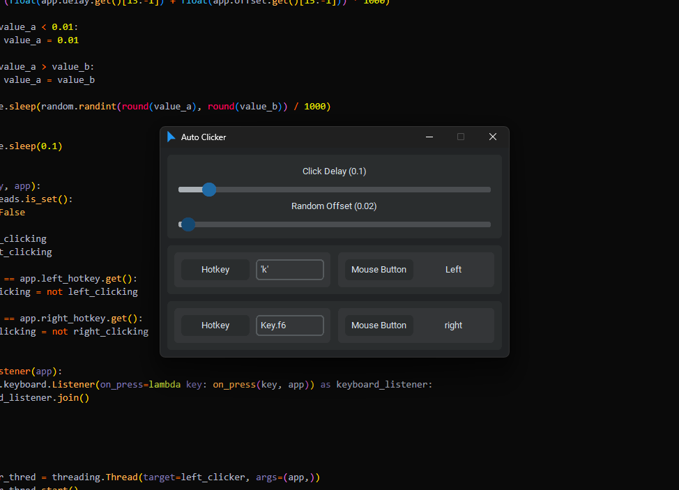

# Auto Clicker GUI

An auto clicker made with CustomTkinter.



## Install Dependencies

Install the necessary dependencies.

```text
pip install -r requirements.txt
```

## Notes

Set the random offset to give the time between clicks some randomness. If the click delay is 0.4 and the random offset is 0.2, the click delay will be a random number between 0.2 and 0.6 seconds.

To set letters, symbols, and numbers to hotkeys, they will need an apostrophe around them. Examples: 'x', '7', and '='.

Modifier and function Key assignments must begin with the word "Key". Examples: Key.f6, Key.shift, Key.shift_r, Key.ctrl_l, and Key.enter.
